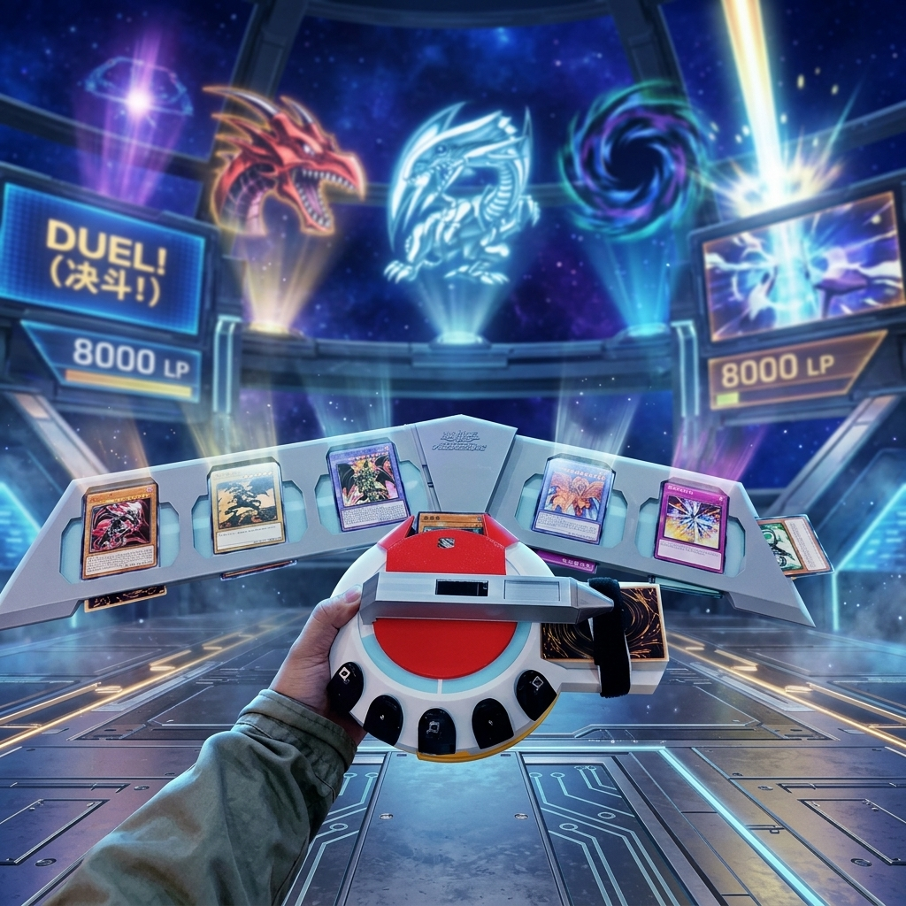
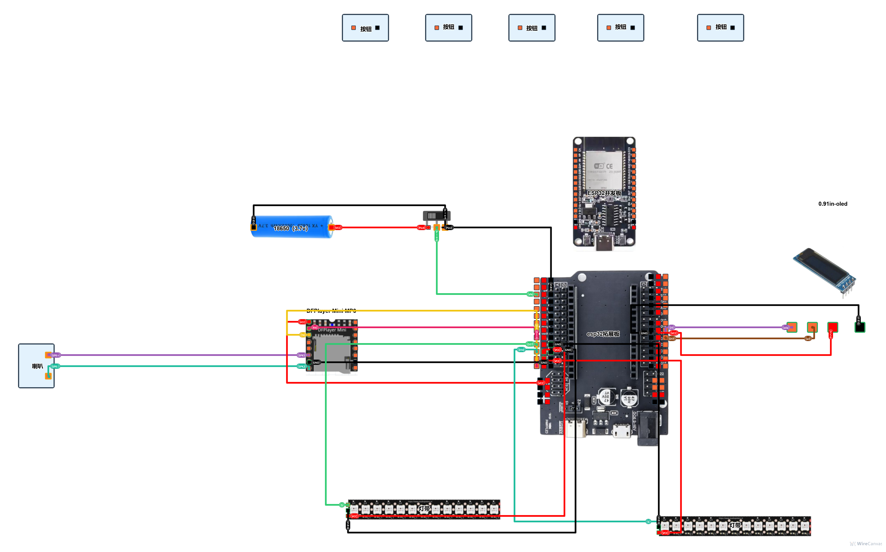

# 🎴 DuelDisk-ESP32 | 决斗盘 ESP32

<p align="center">
  <strong>A Wi-Fi-controllable duel disk system powered by ESP32 & MicroPython</strong><br>
  基于 ESP32 + MicroPython 的 WiFi 控制智能决斗盘
</p>

---


## 🇨🇳 中文介绍

### 项目简介

本项目是一个基于 ESP32 的智能决斗盘系统，灵感来自经典卡牌对战游戏。通过 ESP32 微控制器集成 OLED 显示、舵机控制、音频播放、WS2812 灯光、RFID 读卡等功能，并通过 WiFi AP 模式提供网页控制界面，实现远程操控。

### ✨ 功能特性

| 功能模块 | 说明 |
|---------|------|
| 🖥️ OLED 显示 | SSD1306 128x32 OLED，支持 LP 生命值老虎机滚动动画 |
| 🎵 音频系统 | DFPlayer Mini，支持音效播放、随机背景音乐、音量调节 |
| 💡 WS2812 灯带 | 双灯带（各 30 珠），支持常亮 / 彩虹 / 呼吸 / 音乐闪烁 |
| 📡 WiFi 控制 | AP 热点模式（192.168.4.1），网页控制 LP、音乐、灯光、音量 |
| 🔧 舵机控制 | 机械爪开合控制 |
| 📋 RFID 读卡 | RC522 射频模块，支持 Mifare 1K 卡片 UID 读取 |

### 🔗 引脚分配

```

┌─────────────────────────────────────────┐
│              ESP32 引脚映射              │
├─────────────┬─────────────┬─────────────┤
│    模块      │    引脚     │   GPIO      │
├─────────────┼─────────────┼─────────────┤
│ OLED SDA    │ I2C 数据    │ GPIO 5      │
│ OLED SCL    │ I2C 时钟    │ GPIO 17     │
│ DFPlayer TX │ UART 发送   │ GPIO 13     │
│ DFPlayer RX │ UART 接收   │ GPIO 12     │
│ WS2812 灯带1│ 数据        │ GPIO 27     │
│ WS2812 灯带2│ 数据        │ GPIO 14     │
└─────────────┴─────────────┴─────────────┘
```

### 📱 网页控制

连接 ESP32 的 WiFi 热点后，访问 `192.168.4.1` 即可打开控制面板：

- **LP 控制**：修改双方生命值，支持一键重置
- **音乐播放**：选择指定曲目或随机背景音乐
- **灯光模式**：切换灯带颜色和模式（常亮/彩虹/呼吸/关闭）
- **音量调节**：滑块 + 快捷按钮（±1/±5）

### 📁 项目结构

```
duel_project/
├── main.py          # 主程序（AP + Web Server + LED + 控制）
├── config.py        # 引脚与网络配置
├── audio.py         # DFPlayer Mini 音频控制
├── servo.py         # 舵机控制
├── oled_big.py      # OLED 大字体显示
├── ssd1306.py       # SSD1306 驱动
├── mfrc522.py       # RC522 RFID 驱动
├── rfid.py          # RFID 读卡逻辑
├── rmt.py           # 红外发射
├── boot.py          # 启动脚本
└── duel_net.py      # WiFi 网络模块（STA 模式预留）
```

### 🛠️ 快速开始

**1. 环境准备**
- ESP32 开发板
- MicroPython 固件（v1.28+）
- Thonny IDE 或 mpremote 工具

**2. 烧录固件**
```bash
esptool --port COM3 erase_flash
esptool --port COM3 --baud 460800 write_flash 0x1000 esp32-micropython.bin
```

**3. 上传代码**
```bash
ampy -p COM3 put main.py
ampy -p COM3 put config.py
ampy -p COM3 put audio.py
# ... 上传所有文件
```

**4. 连接使用**
- ESP32 启动后自动创建 WiFi 热点
- 手机/电脑连接该热点
- 浏览器访问 `192.168.4.1`

### 📦 硬件清单

- ESP32 开发板 ×1
- SSD1306 OLED 128×32 ×1
- DFPlayer Mini + 小喇叭 ×1
- SG90 舵机 ×1
- WS2812 灯带 ×2（各 30 珠）
- RC522 RFID 模块 ×1
- 按键开关 ×1
- 杜邦线若干

### 📄 许可证

MIT License

---

## 🇬🇧 English

### Overview

DuelDisk-ESP32 is a smart duel disk system built on ESP32 with MicroPython. Inspired by classic card battle games, it integrates OLED display, servo control, audio playback, WS2812 LED strips, RFID card reading, and a web-based control panel over WiFi AP mode.

### Features

| Module | Description |
|--------|-------------|
| 🖥️ OLED Display | SSD1306 128×32, LP life points slot-machine scroll animation |
| 🎵 Audio | DFPlayer Mini, sound effects, random BGM, volume control |
| 💡 WS2812 LEDs | Dual strips (30 LEDs each), Solid / Rainbow / Breath / Music Flash |
| 📡 WiFi Control | AP hotspot (192.168.4.1), web UI for LP, music, LEDs, volume |
| 🔧 Servo | Mechanical gripper open/close control |
| 📋 RFID | RC522 module, Mifare 1K card UID reading |

### Pin Mapping

```
┌─────────────────────────────────────────┐
│            ESP32 Pin Mapping            │
├─────────────┬─────────────┬─────────────┤
│   Module    │   Signal    │   GPIO      │
├─────────────┼─────────────┼─────────────┤
│ OLED SDA    │ I2C Data    │ GPIO 5      │
│ OLED SCL    │ I2C Clock   │ GPIO 17     │
│ DFPlayer TX │ UART TX     │ GPIO 13     │
│ DFPlayer RX │ UART RX     │ GPIO 12     │
│ Servo       │ PWM Signal  │ GPIO 27     │
│ Button      │ Digital In  │ GPIO 14     │
│ WS2812 #1   │ Data        │ GPIO 27     │
│ WS2812 #2   │ Data        │ GPIO 14     │
└─────────────┴─────────────┴─────────────┘
```

### Web Control Panel

After connecting to the ESP32's WiFi hotspot, visit `192.168.4.1`:

- **LP Control**: Modify life points for both players, one-tap reset
- **Music**: Play specific tracks or random background music
- **LEDs**: Switch color and mode (Solid / Rainbow / Breath / Off)
- **Volume**: Slider + quick buttons (±1 / ±5)

### Project Structure

```
duel_project/
├── main.py          # Main program (AP + Web Server + LEDs + Control)
├── config.py        # Pin & network configuration
├── audio.py         # DFPlayer Mini audio controller
├── servo.py         # Servo motor controller
├── oled_big.py      # OLED large font display
├── ssd1306.py       # SSD1306 OLED driver
├── mfrc522.py       # RC522 RFID driver
├── rfid.py          # RFID card reading logic
├── rmt.py           # IR transmitter
├── boot.py          # Boot script
└── duel_net.py      # WiFi network module (STA mode reserved)
```

### Quick Start

**1. Prerequisites**
- ESP32 development board
- MicroPython firmware (v1.28+)
- Thonny IDE or mpremote tool

**2. Flash Firmware**
```bash
esptool --port COM3 erase_flash
esptool --port COM3 --baud 460800 write_flash 0x1000 esp32-micropython.bin
```

**3. Upload Code**
```bash
ampy -p COM3 put main.py
ampy -p COM3 put config.py
ampy -p COM3 put audio.py
# ... upload all files
```

**4. Connect & Play**
- ESP32 boots and creates a WiFi hotspot automatically
- Connect your phone or computer to the hotspot
- Open browser and navigate to `192.168.4.1`

### Bill of Materials

| Component | Quantity |
|-----------|----------|
| ESP32 Dev Board | ×1 |
| SSD1306 OLED 128×32 | ×1 |
| DFPlayer Mini + Speaker | ×1 |
| SG90 Servo | ×1 |
| WS2812 LED Strip (30 LEDs) | ×2 |
| RC522 RFID Module | ×1 |
| Push Button | ×1 |
| DuPont Wires | As needed |

### License

MIT License
